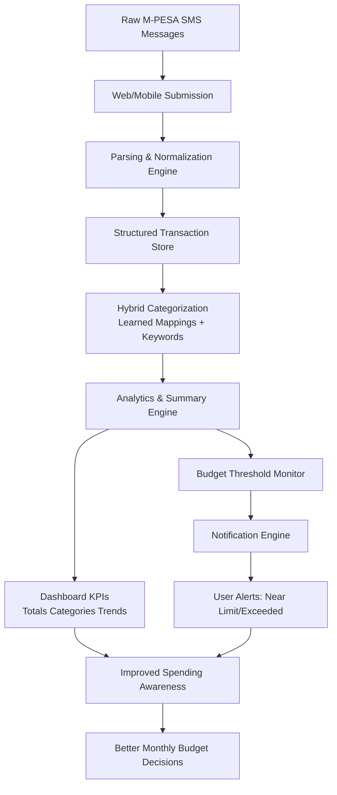

# DESIGN AND IMPLEMENTATION OF AN M-PESA SMS SPENDING ANALYZER FOR PERSONAL FINANCIAL MANAGEMENT

STUDENT NAME: [INSERT FULL NAME]

REGISTRATION NUMBER: [INSERT REG. NUMBER]

A project report submitted in partial fulfillment of the requirements for the award of the degree of Bachelor of Science in [INSERT DEGREE PROGRAM] of Kabarak University.

Department of Computer Science and Information Technology

Kabarak University

February 2026

<<<PAGE_BREAK>>>

# DECLARATION

I declare that this project report is my original work and has not been submitted to this or any other institution for award of a degree, diploma, or certificate.

Student Name: _______________________________

Registration Number: _________________________

Signature: _________________________________

Date: _____________________________________

<<<PAGE_BREAK>>>

# RECOMMENDATION

This project report has been submitted for examination with my approval as the university supervisor.

Supervisor Name: _____________________________

Signature: __________________________________

Date: ______________________________________

Department: Computer Science and Information Technology

Kabarak University

<<<PAGE_BREAK>>>

# COPYRIGHT

Copyright © 2026 [INSERT FULL NAME]

No part of this project report may be reproduced, stored in a retrieval system, or transmitted in any form or by any means without prior written permission of the author or Kabarak University, except for brief quotations in scholarly review.

<<<PAGE_BREAK>>>

# ACKNOWLEDGEMENT

I thank God for the strength and wisdom throughout this project period. I sincerely appreciate my supervisor for the guidance, technical direction, and continuous feedback that shaped this work from proposal to implementation.

I also appreciate the lecturers in the Department of Computer Science and Information Technology for the knowledge and support offered during the course of study. Special thanks go to my classmates and friends for peer reviews, testing assistance, and constructive suggestions during system development.

Finally, I thank my family for moral, emotional, and financial support, which made completion of this project possible.

<<<PAGE_BREAK>>>

# DEDICATION

This report is dedicated to my family for their unwavering support and encouragement, and to all students and young professionals seeking practical technology solutions to improve personal financial management.

<<<PAGE_BREAK>>>

# ABSTRACT

Mobile money has become the dominant transaction channel for many households in Kenya, yet personal spending analysis remains mostly manual and inconsistent. This project presents the design and implementation of an M-PESA SMS Spending Analyzer that converts raw M-PESA confirmation messages into structured transaction records, automatically categorizes expenses, and presents real-time spending summaries through a lightweight web dashboard and an API-driven mobile app foundation. The system was developed using FastAPI for backend services, SQLAlchemy for data persistence, a static HTML/CSS/JavaScript web frontend, and an Expo React Native prototype that prepares the solution for future app-based delivery.

The project adopted an iterative Agile-oriented development approach with mixed methods of requirement gathering, including document analysis, observation of user pain points, and scenario-based validation. Core modules implemented include user authentication, SMS parsing and normalization, hybrid transaction categorization, budget limit management, spending insights, notification generation, and cross-client API access. The system supports single and bulk message analysis, transaction history retrieval, summary visualization, and monthly spending-tracker workflows, while the mobile client currently provides account access, API configuration, and authenticated summary retrieval.

Results show that the prototype effectively reduces manual bookkeeping effort, improves visibility into spending patterns, and supports faster monthly financial reflection. The project demonstrates that simple, explainable analytics built on existing SMS data can provide immediate personal finance value without requiring expensive integrations. Future work will extend the current platform into a fuller spending tracker application with richer mobile workflows, offline synchronization, improved budgeting, and broader message-format coverage.

Keywords: API, budgeting, categorization, financial analytics, M-PESA, mobile app, mobile money, SMS parsing, spending tracker.

<<<PAGE_BREAK>>>

# TABLE OF CONTENTS

DECLARATION ................................................................................. ii

RECOMMENDATION ........................................................................ iii

COPYRIGHT .................................................................................... iv

ACKNOWLEDGEMENT .................................................................... v

DEDICATION ................................................................................... vi

ABSTRACT ...................................................................................... vii

LIST OF TABLES ............................................................................. viii

LIST OF FIGURES ........................................................................... ix

LIST OF ABBREVIATIONS ............................................................... x

CHAPTER ONE: INTRODUCTION .................................................... 1

1.1 Introduction ............................................................................... 1

1.2 Background of the Study ............................................................ 2

1.3 Problem Statement .................................................................... 3

1.4 Objectives ................................................................................. 4

1.5 Research Questions ................................................................... 5

1.6 Significance of the Study ........................................................... 5

1.7 Scope and Limitation of the Study .............................................. 6

1.8 Proposed Modules ..................................................................... 7

CHAPTER TWO: LITERATURE REVIEW .......................................... 8

2.1 Introduction ............................................................................... 8

2.2 Review of Objective One ............................................................ 9

2.3 Review of Objective Two ............................................................ 11

2.4 Review of Objective Three ......................................................... 13

2.5 Review of Objective Four ........................................................... 15

2.6 Conceptual Framework .............................................................. 17

2.7 Literature Gap Summary ............................................................ 18

CHAPTER THREE: METHODOLOGY ............................................... 19

3.1 Introduction ............................................................................... 19

3.2 Research Design ....................................................................... 20

3.2.1 Development Methodology ..................................................... 21

3.3 Data Collection Methods ........................................................... 23

3.4 System Analysis and Design ...................................................... 24

3.5 Research Ethics ........................................................................ 30

CHAPTER FOUR: SYSTEM IMPLEMENTATION AND DEPLOYMENT ... 31

4.1 Introduction ............................................................................... 31

4.2 Development Environment Setup ............................................... 32

4.3 Implementation Steps ................................................................ 34

4.4 Testing and Quality Assurance ................................................... 39

4.5 Deployment Plan ....................................................................... 43

4.6 Go-Live Plan .............................................................................. 45

4.7 Maintenance and Support .......................................................... 46

4.8 Chapter Summary ...................................................................... 48

CHAPTER FIVE: CONCLUSION, RECOMMENDATIONS AND FUTURE WORK ... 49

5.1 Summary of the Study ............................................................... 49

5.2 Key Contributions ...................................................................... 50

5.3 Limitations ................................................................................. 51

5.4 Recommendations ..................................................................... 52

5.5 Future Work ............................................................................... 53

REFERENCES .................................................................................. 54

APPENDICES ................................................................................... 56

<<<PAGE_BREAK>>>

# LIST OF TABLES

Table 3.1 Functional Requirements of the Proposed System

Table 3.2 Non-Functional Requirements of the Proposed System

Table 3.3 Feasibility Analysis Summary

Table 4.1 Development Tools and Environment

Table 4.2 Functional Test Cases and Outcomes

Table 4.3 Deployment and Rollback Checklist

Table A1 Project Budget Estimate

Table C1 Project Schedule

<<<PAGE_BREAK>>>

# LIST OF FIGURES

Figure 2.1 Conceptual Framework for the M-PESA Spending Analyzer

Figure 3.1 High-Level System Architecture

Figure 3.2 Data Flow for Message Analysis and Dashboard Update

Figure 3.3 Use-Case Summary Diagram (Narrative Form)

Figure 4.1 Authentication and Session Flow

Figure 4.2 Transaction Processing Pipeline

Figure 4.3 Dashboard Summary and Notification Workflow

Figure 4.4 Budget Planning and Actual Comparison Flow

<<<PAGE_BREAK>>>

# LIST OF ABBREVIATIONS

API - Application Programming Interface

DB - Database

ERD - Entity Relationship Diagram

HTML - HyperText Markup Language

HTTP - HyperText Transfer Protocol

IDE - Integrated Development Environment

JSON - JavaScript Object Notation

KES - Kenyan Shilling

MVP - Minimum Viable Product

NLP - Natural Language Processing

ORM - Object Relational Mapping

QA - Quality Assurance

REST - Representational State Transfer

SMS - Short Message Service

SQL - Structured Query Language

UAT - User Acceptance Testing

UI - User Interface

UML - Unified Modeling Language

<<<PAGE_BREAK>>>

# CHAPTER ONE

# INTRODUCTION

## 1.1 Introduction

Kenya continues to record high volumes of mobile money activity, with M-PESA transactions forming a major part of daily personal and household financial behavior. Payments for transport, food, utilities, school needs, and business purchases happen quickly and repeatedly, often leaving users with long SMS inboxes that are difficult to interpret. Although each M-PESA message contains important details such as amount, date, recipient, and reference code, these records are rarely converted into structured spending intelligence in real time. As a result, many users only estimate their expenses at the end of the month, which weakens budgeting discipline and financial planning.

To address this gap, this project proposes and implements an M-PESA SMS Spending Analyzer, a lightweight platform that automatically parses transaction messages, normalizes and categorizes spending records, and presents insights through an interactive dashboard. The solution is designed around an API-first architecture so that web and mobile clients can consume the same analysis services consistently. In addition, the system supports budget-limit monitoring and notification workflows to strengthen early awareness when expenditure trends become risky.

This chapter presents the study background, problem statement, objectives, research questions, significance, scope, limitations, and the core modules that make up the developed system.

## 1.2 Background of the Study

Mobile money has transformed financial activity in East Africa by making digital transactions possible without requiring traditional banking infrastructure for every interaction. In Kenya, M-PESA is used across income levels for daily activities including fare payments, airtime purchase, utility bills, peer-to-peer transfers, and merchant payments. The large transaction volume creates a rich digital trail that can support personal budgeting and decision-making.

Despite this opportunity, many users still rely on memory, handwritten notes, or end-month guesswork to estimate where money was spent. Existing finance tools may require manual entry, external bank integration, or paid subscriptions, which reduce adoption among students and low-to-middle income users. Since M-PESA users already receive transaction messages, a lightweight analyzer that works directly from SMS text can provide immediate value with minimal setup.

Within this context, the present study designed and implemented a practical API-driven system that ingests M-PESA messages, extracts key transaction fields, applies category logic, and visualizes spending behavior through a web interface while also laying the foundation for a mobile spending tracker application. The system also introduces user-scoped authentication, budget limit monitoring, and basic notification generation to strengthen financial awareness and accountability.

## 1.3 Problem Statement

Current personal expense tracking for many M-PESA users in Kenya is fragmented, manual, and inefficient. Although transaction confirmations are sent instantly by SMS, users often leave this information scattered across inboxes without a centralized way to structure and analyze spending in real time. This causes delays in identifying overspending, creates data gaps in budgeting, and limits timely corrective action.

Existing alternatives are frequently disconnected from direct SMS workflows, require manual entry, or involve setup and integration barriers that reduce adoption. As a result, individuals and households remain under-informed about daily spending behavior and month-end financial risk. Therefore, there is a need for a centralized, user-driven platform that automatically parses M-PESA messages, categorizes transactions, and presents live financial insights to improve budgeting decisions and financial control.

## 1.4 Objectives

### 1.4.1 Main Objective

To design and implement a web-based M-PESA SMS spending analysis platform that enhances real-time expense visibility, budgeting awareness, and user financial decision-making in Kenya.

### 1.4.2 Specific Objectives

i. To identify challenges and user requirements in current M-PESA spending tracking and budgeting practices.

ii. To design an interactive platform that enables users to upload or sync SMS records and visualize categorized transactions through a live dashboard.

iii. To develop a working prototype integrating automated SMS parsing, category analytics, budget-limit monitoring, and notification support.

iv. To evaluate the system’s usability, reliability, and efficiency in improving expense tracking, awareness, and budget compliance.

## 1.5 Research Questions

i. What are the major challenges and user needs in existing M-PESA-based spending tracking mechanisms?

ii. How can a web platform enable users to convert raw M-PESA SMS messages into clear, categorized spending information in real time?

iii. How effective is the system in delivering timely budget alerts and supporting financial decision-making?

iv. How does the platform improve spending accuracy, usability, and overall personal financial coordination?

## 1.6 Significance of the Study

This project empowers M-PESA users to actively monitor their financial behavior through structured, real-time spending information derived from SMS records. It strengthens personal and household budgeting by highlighting category trends, unusual spending spikes, and near-limit alerts before month-end pressure escalates.

Practically, the platform demonstrates how affordable digital finance intelligence can be built from tools already available to most users, without requiring full banking integrations. Academically, the study combines backend engineering, web analytics, and applied data processing in a real-world problem-solving context. It provides a reusable foundation for future work in intelligent categorization, predictive budgeting, and broader digital financial inclusion initiatives in Kenya.

## 1.7 Scope and Limitation of the Study

### Scope

The study focuses on developing a Minimum Viable Product (MVP) for M-PESA spending analysis in Kenya featuring:

- A web interface for user authentication, transaction ingestion, and dashboard-based expense tracking.

- Automated M-PESA SMS parsing and normalization for structured storage and reporting.

- Category summaries, trend insights, and budget-limit alerts to support timely user action.

- API-first integration to support current web clients and future mobile application expansion.

### Limitations

Mobile inbox synchronization automation, advanced machine-learning categorization, and large-scale production deployment are outside this phase. System performance and insight quality also depend on message consistency, internet access, and active user participation in reviewing or correcting categories. Despite these limitations, the MVP demonstrates the feasibility and value of practical, SMS-driven personal finance analytics for M-PESA users.

## 1.8 Proposed Modules

The system was designed around the following modules:

Module 1: User Registration and Authentication

This module manages account creation, login, and session access control. It validates credentials, hashes passwords with PBKDF2-SHA256, issues bearer tokens, and supports token expiry and invalidation rules for secure API access.

Module 2: SMS Parsing and Normalization

This module processes raw M-PESA SMS messages and extracts structured fields such as amount, reference code, transaction direction, recipient, and timestamp. It standardizes outputs for downstream storage and reporting.

Module 3: Transaction Categorization and Learning

This module assigns transaction categories using a hybrid strategy. It first checks user-specific learned mappings and then applies keyword-based fallback logic. Manual category changes are remembered for future consistency.

Module 4: Summary and Insight Engine

This module computes total spending, category aggregates, average daily spending, and simple warning signals, including high betting share and frequent small transfers.

Module 5: Budget Limit and Notification Management

This module stores monthly budget limits per user, calculates usage thresholds, and generates deduplicated notifications when budget consumption nears or exceeds limits.

Module 6: Web and Mobile Interaction Layer

This module provides user-facing web pages for account access, message ingestion (single and bulk), transactions review, summary visualization, and budget planning/actual comparison, while also exposing the same services to a mobile client foundation that will evolve into a dedicated spending tracker app.

<<<PAGE_BREAK>>>

# CHAPTER TWO

# LITERATURE REVIEW

## 2.1 Introduction

This chapter reviews academic and technical literature relevant to the development of the **M-PESA SMS Spending Analyzer**. The review establishes the conceptual and technical basis for the project, evaluates prior work in mobile money analytics and personal finance tooling, and identifies practical implementation gaps that this system addresses.

The analysis is organized around the project's objectives: understanding existing user challenges, evaluating parsing and storage approaches, assessing categorization and dashboard methods, and examining web/mobile delivery patterns for low-friction personal finance systems.

## 2.2 Theoretical Framework

The project is grounded in the **Technology Acceptance Model (TAM)** (Davis, 1989), which explains system adoption through two constructs: **Perceived Usefulness (PU)** and **Perceived Ease of Use (PEOU)**.

### 2.2.1 Perceived Usefulness (PU)

For M-PESA users, perceived usefulness is reflected in whether the system can:

1. Convert raw SMS records into understandable spending summaries.
2. Reveal category-level spending patterns quickly.
3. Provide timely budget threshold warnings.
4. Support better day-to-day spending decisions.

If users see immediate value in these outputs, they are more likely to adopt the analyzer consistently.

### 2.2.2 Perceived Ease of Use (PEOU)

Ease of use is essential because many users abandon finance apps that require heavy manual entry. The system therefore emphasizes:

1. Simple ingestion of pasted or bulk SMS messages.
2. Automatic parsing and categorization with minimal user effort.
3. Clear dashboard presentation of totals, categories, and trends.
4. Straightforward correction flow when category adjustments are needed.

These design choices reduce effort and increase continued use.

## 2.3 Review of Related Literature

### 2.3.1 Mobile Money and Personal Finance Behavior

Research on M-PESA shows strong impact on financial inclusion and household resilience (Suri & Jack; Jack & Suri). However, high transaction availability does not automatically translate to better financial decisions. Users often lack tools that turn transaction traces into interpretable budgeting intelligence.

Literature on personal finance behavior further shows that low-friction feedback loops improve awareness and planning, while delayed or manual recordkeeping reduces adherence.

### 2.3.2 SMS Parsing and Structured Data Extraction

M-PESA messages are semi-structured and therefore suitable for rule-based extraction methods in constrained domains. Prior software engineering literature supports deterministic parsers when explainability, reliability, and low computational overhead are priorities.

Regular-expression extraction combined with validation logic can reliably capture core fields such as amount, date-time, transaction code, direction, and counterpart descriptors. Defensive parsing strategies are particularly important when template variations and partial text corruption occur.

### 2.3.3 Categorization and Human-in-the-Loop Learning

Spending categorization literature commonly distinguishes between rule-based, machine-learning, and hybrid approaches. For early-stage, explainability-first tools, hybrid approaches are frequently preferred.

A practical pattern is to apply user-learned mappings first (from prior corrections), then keyword fallback logic for unseen descriptions. This balances consistency, transparency, and adaptability across evolving spending patterns.

### 2.3.4 Dashboard Analytics and Behavioral Insight

Visualization studies indicate that concise KPIs and category distributions reduce cognitive load and improve decision speed. Typical high-value indicators include total spending, top spending category, transaction count, and warning flags.

Rule-based insights (for example high betting share or high frequency micro-transfers) can provide actionable nudges without requiring opaque scoring models.

## 2.4 Review of Similar Systems

### 2.4.1 Conventional Budgeting Applications

Many mainstream budgeting apps assume direct bank integrations, subscriptions, or high manual data entry. In mobile-money-first contexts, these assumptions create usability friction and reduce sustained engagement.

### 2.4.2 Bank-Centric Personal Finance Dashboards

Bank dashboards provide strong account-centric analytics but are often inaccessible to users whose primary transaction channel is mobile money SMS. Their architecture and onboarding flows may not match informal or hybrid financial behavior patterns.

### 2.4.3 SMS Expense Trackers and Lightweight Ledgers

Lightweight trackers improve accessibility but often lack robust parsing, adaptive categorization, and integrated budget alerting. Where analytics exist, they are sometimes too shallow to support practical monthly planning.

## 2.5 Identified Gaps and Proposed Improvements

From the literature and system review, three major implementation gaps emerge:

1. **Low-Friction SMS-to-Insight Pipelines Are Rare:** Existing tools either over-rely on manual entry or depend on unavailable banking APIs.
2. **Category Consistency Is Weak Over Time:** Many systems do not effectively learn from user corrections.
3. **Budget Monitoring Is Often Reactive:** Users get poor warning visibility before overspending.

To address these gaps, the M-PESA SMS Spending Analyzer implements:

1. **Unified SMS Ingestion and Parsing:** Single and bulk message input transformed into structured transaction records.
2. **Hybrid Categorization with Learning:** User corrections persist and improve future categorization accuracy.
3. **Action-Oriented Dashboard and Alerts:** Category breakdowns, summary metrics, and threshold notifications for proactive control.

## 2.6 Conceptual Framework

The conceptual framework explains how raw SMS messages are converted into budgeting intelligence.

### 2.6.1 Conceptual Diagram

### 2.6.2 Variable Relationship Summary

**Independent Variables**

1. Availability and quality of SMS transaction messages.
2. Parser and normalization logic quality.
3. Categorization rule coverage and learned mapping depth.
4. Budget limit configuration by users.

**Intervening Variables**

1. SMS format variability.
2. User correction behavior.
3. Infrastructure/deployment constraints.
4. Data completeness and sync consistency.

**Dependent Variables**

1. Categorization accuracy and consistency.
2. Timeliness of budget alerts.
3. User visibility into spending behavior.
4. Improvement in short-term budgeting decisions.

## 2.7 How the Web and Mobile Applications Work

The analyzer uses one backend service with both web and mobile clients consuming the same API and business logic.

### 2.7.1 Web Application Workflow

1. User authenticates via the web interface.
2. User submits one SMS or uploads/pastes multiple SMS entries.
3. Backend parses messages, stores structured transactions, and applies categorization.
4. Dashboard displays totals, category aggregates, and warnings.
5. User can edit categories; edits update learned mappings for future predictions.

### 2.7.2 Mobile Application Workflow

1. User signs in through the mobile app.
2. User submits SMS content or syncs captured transaction text.
3. The same backend parsing and categorization pipeline is executed.
4. Mobile views show summaries, recent transactions, and budget status.
5. Alerts are shown in-app (and can be extended to push notifications in future iterations).

### 2.7.3 Integrated Web–Mobile Operation Model

Both clients operate as synchronized channels to one data and analytics core, ensuring:

- Consistent categorization logic across platforms.
- Real-time data parity between web and mobile views.
- Reuse of user-learned mappings regardless of entry channel.
- Easier maintenance through centralized API-first architecture.

## 2.8 Chapter Summary

This chapter reviewed relevant literature on mobile money usage, SMS parsing, transaction categorization, dashboard analytics, and usability-driven finance tooling. TAM was adopted to frame likely user adoption through usefulness and ease of use.

The review identified clear gaps in low-friction SMS analytics, adaptive categorization, and proactive budget monitoring. The proposed M-PESA SMS Spending Analyzer addresses these gaps through integrated parsing, hybrid learning, actionable summaries, and synchronized web/mobile delivery. These findings directly inform the methodology and implementation decisions in Chapter Three.

<<<PAGE_BREAK>>>

# CHAPTER THREE

# METHODOLOGY

## 3.1 Introduction

This chapter explains **how this project was actually executed** from requirements gathering to implementation and validation. Rather than presenting methodology as theory only, the chapter links each method to concrete outputs in the M-PESA SMS Spending Analyzer: API modules, parsing/categorization logic, dashboard views, and budget/notification features.

The chapter covers the research approach, SDLC process, requirement sources, analysis and design decisions, and ethical controls used when handling financial SMS data.

## 3.2 Research Methodology and System Development Life Cycle (SDLC)

### 3.2.1 Research Design

The project used a **Design Science Research (DSR)** orientation because the goal was to build an artifact that solves a practical problem: turning raw M-PESA confirmation SMS messages into usable spending intelligence.

In this study, DSR was applied in three practical steps:

1. **Problem identification**: users struggle with manual tracking, category inconsistency, and late visibility of overspending.
2. **Artifact design and construction**: we implemented a working analyzer with authentication, ingestion, parsing, categorization, storage, summaries, insights, budgeting, and notifications.
3. **Evaluation and refinement**: outputs were checked using scenario-driven tests (single message, bulk message, duplicate references, budget threshold crossing, and category correction workflows).

This design was selected because it matches software capstone work where usefulness is demonstrated through a functioning, testable system.

### 3.2.2 Software Development Methodology

Development followed an **iterative Agile workflow** (Scrum-like short cycles). Each cycle produced a usable increment and then incorporated fixes based on observed behavior.

How the iterations were executed:

1. **Backend foundation**: project bootstrap, router wiring, health endpoint, database setup.
2. **Security and identity**: registration/login, token issuance, password hashing, current-user dependency.
3. **Transaction ingestion pipeline**: SMS parsing, normalization, categorization, duplicate checks, transaction persistence.
4. **Analytics features**: summary endpoint, insights engine, and transaction browsing.
5. **Budget control and alerts**: budget-limit APIs plus notification generation and read-state management.
6. **Client integration**: web pages for auth/spending/dashboard/budget and mobile authentication + summary consumption.

Why this worked for our project:

- It reduced risk by isolating complex tasks (especially parsing and categorization).
- It allowed quick correction of parser/categorizer edge cases.
- It kept implementation aligned with user flows instead of building unused features first.

## 3.3 Requirements Gathering and Data Collection Methods

Requirements were gathered using lightweight but practical techniques appropriate for a development project:

1. **Document review**: framework docs, API references, and prior project notes informed implementation constraints and best practices.
2. **Workflow observation**: we examined how users currently review M-PESA messages and where manual tracking fails.
3. **Scenario-based test data**: representative SMS samples were prepared for deposits, withdrawals, paybill, send money, and ambiguous formats.
4. **Implementation feedback loop**: as endpoints and UI screens were exercised, requirements were refined (for example, adding better feedback errors, deduplication behavior, and budget alert checks).

This approach ensured requirements stayed tied to real execution outcomes rather than remaining purely conceptual.

## 3.4 System Analysis and Design

### 3.4.1 System Analysis

#### Core Functional Requirements (Implemented)

The implemented system supports the following functions:

1. User registration, login, and authenticated profile retrieval.
2. Single SMS analysis and bulk SMS ingestion.
3. Transaction categorization and later category correction.
4. Transaction listing and clearing (per user scope).
5. Summary and insights generation from stored transactions.
6. Budget limit configuration and retrieval.
7. Notification generation, listing, and read management.
8. Shared backend consumption by both web and mobile clients.

#### Non-Functional Requirements

1. **Security**: hashed passwords, token-based access, user-isolated records.
2. **Reliability**: robust handling of malformed SMS and partial bulk-ingestion failures.
3. **Performance**: responsive endpoints for regular personal-scale workloads.
4. **Usability**: simple interfaces and clear API/UI feedback messages.
5. **Maintainability**: modular code separation (API endpoints, parsing, categorization, insights, notifications, models).
6. **Portability**: support for SQLite and MySQL/MariaDB configurations.

#### Feasibility Summary

- **Technical**: feasible with current stack and available tooling.
- **Economic**: feasible due to open-source technologies.
- **Operational**: feasible because it uses existing SMS artifacts users already receive.
- **Schedule**: feasible for MVP delivery under iterative scope control.

### 3.4.2 System Design

#### Architectural Design

A three-layer architecture was used:

1. **Presentation layer**: web client (HTML/CSS/JavaScript) and mobile client (React Native/Expo).
2. **Application layer**: FastAPI services for auth, ingestion, analysis, summaries, insights, budgets, and notifications.
3. **Data layer**: SQLAlchemy ORM models persisted in SQLite/MySQL.

This structure kept business logic centralized in the API while allowing multiple clients to reuse the same services.

#### Processing Flow (How a Message Becomes an Insight)

1. User submits SMS text from web/mobile.
2. Request is authenticated.
3. Parser extracts structured fields.
4. Categorizer assigns a category (with learned-rule support where available).
5. Transaction is saved for that authenticated user.
6. Summary/insight and budget-alert checks run on stored data.
7. Updated results are returned to clients.

#### Major Components

- **Security/auth**: registration, login, token lifecycle, current-user dependency.
- **Ingestion/analysis**: single and bulk ingestion endpoints.
- **Parser and normalizer**: extraction and cleanup of SMS transaction fields.
- **Categorizer**: rules + learned mappings.
- **Insights and notifications**: spending signals, threshold alerts, read management.
- **Client modules**: auth, spending, dashboard, and budget views.

#### Database Design Overview

Main entities include users, authentication tokens, transactions, category-learning rules, budget limits, and notifications. Constraints and indexes are applied to preserve data integrity and improve retrieval efficiency.

#### Technologies Used in This Project

- **Backend**: Python, FastAPI, SQLAlchemy, Pydantic, Uvicorn.
- **Storage**: SQLite by default; MySQL/MariaDB optional.
- **Web frontend**: HTML5, CSS3, Bootstrap, Vanilla JavaScript.
- **Mobile app foundation**: React Native/Expo.
- **Version control**: Git-based incremental development.

## 3.5 Research Ethics and Data Protection Considerations

Although this is an academic software project, financial SMS data required explicit safeguards:

1. Prefer synthetic/anonymized SMS samples during testing.
2. Enforce account-level data isolation so one user cannot read another user’s transactions.
3. Store only fields required for analysis and reporting.
4. Protect credentials using password hashing and token verification.
5. Communicate parser and categorization limitations clearly to avoid misleading financial interpretation.

These controls were integrated into implementation decisions and testing practice.

<<<PAGE_BREAK>>>

# CHAPTER FOUR

# SYSTEM IMPLEMENTATION, VALIDATION, AND DEPLOYMENT

## 4.1 Introduction

This chapter summarizes how the M-PESA SMS Spending Analyzer was implemented, tested, and prepared for deployment. It presents the production-relevant setup, implementation status by module, validation outcomes, and operational readiness checkpoints.

> **[INSERTION NOTE 4-A]** Add your institution’s preferred wording for “implementation success criteria” if your department requires measurable acceptance criteria in Chapter Four.

## 4.2 Current Implementation Stack (Updated)

The implemented system uses:

- **Backend:** Python + FastAPI (REST API)
- **Data access:** SQLAlchemy ORM
- **Validation:** Pydantic schemas
- **Database:** SQLite (default) with MySQL/MariaDB compatibility
- **Web client:** HTML, CSS, Bootstrap, Vanilla JavaScript
- **Mobile client:** React Native (Expo)
- **Runtime server:** Uvicorn
- **Version control:** Git

This stack was retained because it supports rapid development, clear API contracts, and easy transition from local proof-of-concept to small-scale hosted environments.

> **[ADD-ON 4-B]** Insert exact software versions used during final testing (Python, FastAPI, Node/Expo, DB engine) for examiner reproducibility.

## 4.3 Implementation Status by Module

### 4.3.1 Backend Services

Implemented backend capabilities include:

1. **Authentication** (`/auth/register`, `/auth/login`, `/auth/me`) with password hashing and token-based access control.
2. **SMS analysis** (`/analyze`, `/analyze/bulk`) for extracting amount, recipient/reference, transaction type, and timestamp.
3. **Transaction management** (`/transactions`, update category, delete flows) for review and correction.
4. **Analytics** (`/summary`, `/insights`) for category totals, monthly snapshots, and spending cues.
5. **Budget and notifications** (`/budget/*`, `/notifications/*`) for threshold alerts and read-state management.

### 4.3.2 Web and Mobile Clients

Implemented client-side capabilities include:

- **Web:** authentication, SMS ingestion (single/bulk), dashboard summaries, transaction display, and budget pages.
- **Mobile:** authentication, API configuration, and protected summary retrieval.

Current mobile coverage is intentionally limited to core access and summary verification, while full ingestion and budgeting interactions remain roadmap items.

> **[INSERTION NOTE 4-C]** Add 1–2 screenshots of the dashboard and notification/budget views if your submission guidelines require evidence of running interfaces.

## 4.4 Testing and Validation Results

Testing focused on functional reliability and end-user flow continuity.

### 4.4.1 Test Scope

The following were validated:

- User registration/login success and failure paths
- Single and bulk SMS parsing behavior
- Parse-error handling for malformed messages
- Summary and category aggregation correctness
- Manual category correction persistence
- Budget-threshold notification generation
- Unauthorized access rejection on protected routes

### 4.4.2 Outcome Summary

All core functional tests passed in the controlled environment used for development. Results indicate the platform is stable for academic demonstration and pilot-style usage.

### 4.4.3 Quality Controls Applied

- Input validation through typed schemas
- User-scoped data access enforcement
- Duplicate transaction checks
- Structured error responses for client recovery

> **[ADD-ON 4-D]** Insert a compact test matrix (Test ID, Expected Result, Actual Result) if your supervisor requests tabulated evidence rather than narrative reporting.

## 4.5 Deployment and Operational Readiness

Deployment readiness steps include:

1. Install backend dependencies and configure environment variables.
2. Initialize and verify database connectivity.
3. Start API service and validate health endpoints.
4. Serve web static files and confirm API integration.
5. Run smoke flow: register/login → ingest SMS → view summary → check notifications.

A rollback approach is defined: restore prior configuration/code revision and restart the last stable release.

## 4.6 Post-Deployment Support Plan

Planned maintenance covers parser rule expansion, category quality improvements, dependency/security updates, and performance tuning. Support documentation should include API usage notes, common troubleshooting steps, and change logs.

> **[INSERTION NOTE 4-E]** Add your actual hosting target (e.g., VPS, university server, or cloud PaaS) and ownership model for ongoing maintenance.

## 4.7 Chapter Summary

Chapter Four confirms that the solution has been implemented end-to-end at prototype level, validated across core workflows, and prepared with a practical deployment and maintenance approach suitable for submission and controlled rollout.

<<<PAGE_BREAK>>>

# CHAPTER FIVE

# CONCLUSION, RECOMMENDATIONS, AND SUBMISSION READINESS

## 5.1 Conclusion

This study addressed the challenge of turning raw M-PESA SMS records into usable spending intelligence. The developed system demonstrates that a modular API-driven approach can parse, classify, store, and present transaction insights in a form that supports day-to-day financial awareness.

The project achieved its main objective by delivering authentication, message analysis, categorization support, summary analytics, and budget-notification features through interoperable web and mobile-connected clients.

## 5.2 Key Contributions

Major contributions of this work are:

1. A working prototype for converting mobile money SMS data into structured personal-finance records.
2. A maintainable architecture separating API, data, and client concerns.
3. A hybrid categorization approach combining rule-based logic with user correction feedback.
4. A practical foundation for incremental extension to richer mobile and analytics features.

## 5.3 Study Limitations

The current version has the following limitations:

1. Message-pattern coverage is not exhaustive across all real-world SMS variants.
2. Categorization remains partly heuristic and may need periodic manual correction.
3. Evaluation was performed in controlled development conditions, not large-scale production traffic.
4. Mobile functionality is partial relative to the full product roadmap.

## 5.4 Recommendations

To strengthen the system beyond the current submission stage:

1. Expand parser coverage using a larger anonymized corpus of real transaction messages.
2. Introduce more advanced classification methods (including supervised ML options) after sufficient labeled data is collected.
3. Complete parity between web and mobile workflows (ingestion, review, budgeting, notifications).
4. Add automated CI-based testing for regression control and release confidence.
5. Improve observability with structured logs, metrics, and failure dashboards.

> **[ADD-ON 5-A]** Add recommendation priority labels (Short-term, Medium-term, Long-term) if your department expects implementation phasing.

## 5.5 Future Work

Future enhancements may include:

- Multi-channel transaction ingestion (beyond SMS)
- Forecasting and anomaly detection for proactive spending alerts
- Personalized budget suggestions from historical behavior
- Offline-first synchronization for intermittent connectivity contexts
- Hardened cloud deployment and operations automation

## 5.6 Submission Readiness Checklist

This report version is now concise and aligned for submission. Before final submission, confirm the following:

- Formatting matches departmental template (headings, spacing, pagination, table numbering).
- In-text citations and reference style are consistent.
- Figures/tables referenced in text are present and captioned.
- Any pending screenshots, environment versions, and appendix artifacts are inserted.

> **[FINAL INSERTION NOTE 5-B]** Add your supervisor-specific compliance items here (e.g., plagiarism report ID, declaration page, signed approval page).

## 5.7 Final Remark

The project validates the practical value of software engineering in transforming raw mobile money communication into actionable insights. With the noted extensions, the solution can progress from academic prototype to broader real-world utility.

<<<PAGE_BREAK>>>

# REFERENCES

FastAPI. (n.d.). FastAPI documentation. https://fastapi.tiangolo.com/

Jack, W., & Suri, T. (2011). Mobile money: The economics of M-PESA. National Bureau of Economic Research Working Paper No. 16721. https://doi.org/10.3386/w16721

Nielsen, J. (1994). Usability engineering. Morgan Kaufmann.

OWASP Foundation. (n.d.). Password storage cheat sheet. https://cheatsheetseries.owasp.org/

Pressman, R. S., & Maxim, B. R. (2019). Software engineering: A practitioner's approach (9th ed.). McGraw-Hill.

Pydantic. (n.d.). Pydantic documentation. https://docs.pydantic.dev/

Python Software Foundation. (n.d.). Python documentation. https://docs.python.org/3/

Safaricom PLC. (n.d.). M-PESA services. https://www.safaricom.co.ke/personal/m-pesa

Sommerville, I. (2016). Software engineering (10th ed.). Pearson.

SQLAlchemy. (n.d.). SQLAlchemy documentation. https://docs.sqlalchemy.org/

Suri, T., & Jack, W. (2016). The long-run poverty and gender impacts of mobile money. Science, 354(6317), 1288-1292. https://doi.org/10.1126/science.aah5309

Uvicorn. (n.d.). Uvicorn documentation. https://www.uvicorn.org/

<<<PAGE_BREAK>>>

# APPENDICES

## Appendix A: Project Budget

Table A1 Project Budget Estimate

Item: Laptop and accessories

Estimated Cost (KES): 70,000

Item: Internet and bandwidth (4 months)

Estimated Cost (KES): 8,000

Item: Power and utility contribution

Estimated Cost (KES): 4,000

Item: Documentation and printing

Estimated Cost (KES): 3,500

Item: Testing data bundles and misc.

Estimated Cost (KES): 4,500

Total Estimated Budget (KES): 90,000

## Appendix B: Data Collection Tools

1. SMS Parsing Validation Sheet

Fields collected:

- Raw SMS text

- Expected amount

- Expected timestamp

- Expected direction/type

- Expected recipient/reference

- Parsed output

- Pass/Fail and comments

2. Dashboard Usability Checklist

- Is navigation clear between Dashboard, Spending, Budget, and Account pages?

- Are status messages and errors understandable?

- Can users complete message ingestion in less than three steps?

- Are category summaries easy to interpret?

- Are notification messages actionable?

3. Functional Test Log Template

- Test ID

- Scenario description

- Input payload

- Expected output

- Actual output

- Status

- Tester initials and date

## Appendix C: Project Schedule

Table C1 Project Schedule

Week 1-2: Problem analysis, proposal refinement, requirement definition

Week 3-4: Architecture design and database modeling

Week 5-6: Authentication module implementation

Week 7-8: Parser and categorization module implementation

Week 9-10: Dashboard and transaction module integration

Week 11: Budget and notification features

Week 12: Functional testing and bug fixes

Week 13: Documentation and chapter consolidation

Week 14: Final review, formatting, and submission preparation
