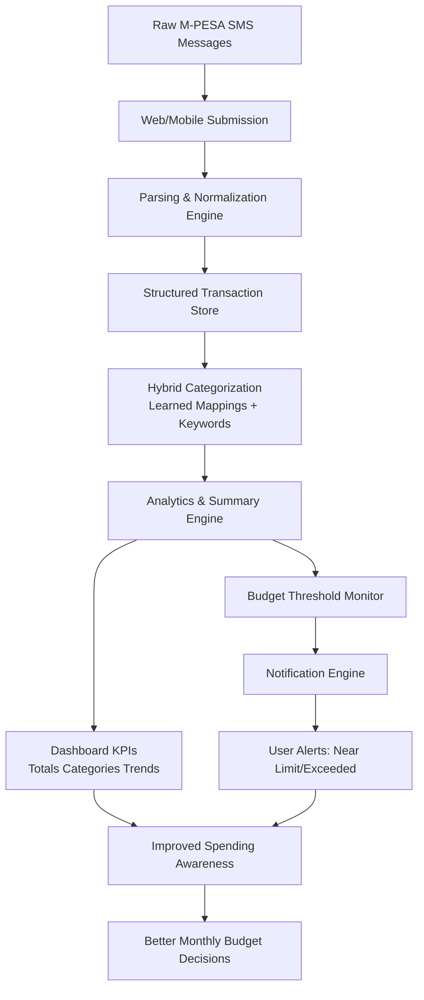

# DESIGN AND IMPLEMENTATION OF AN M-PESA SMS SPENDING ANALYZER FOR PERSONAL FINANCIAL MANAGEMENT

STUDENT NAME: [INSERT FULL NAME]

REGISTRATION NUMBER: [INSERT REG. NUMBER]

A project report submitted in partial fulfillment of the requirements for the award of the degree of Bachelor of Science in [INSERT DEGREE PROGRAM] of Kabarak University.

Department of Computer Science and Information Technology

Kabarak University

February 2026

<<<PAGE_BREAK>>>

# DECLARATION

I declare that this project report is my original work and has not been submitted to this or any other institution for award of a degree, diploma, or certificate.

Student Name: _______________________________

Registration Number: _________________________

Signature: _________________________________

Date: _____________________________________

<<<PAGE_BREAK>>>

# RECOMMENDATION

This project report has been submitted for examination with my approval as the university supervisor.

Supervisor Name: _____________________________

Signature: __________________________________

Date: ______________________________________

Department: Computer Science and Information Technology

Kabarak University

<<<PAGE_BREAK>>>

# COPYRIGHT

Copyright © 2026 [INSERT FULL NAME]

No part of this project report may be reproduced, stored in a retrieval system, or transmitted in any form or by any means without prior written permission of the author or Kabarak University, except for brief quotations in scholarly review.

<<<PAGE_BREAK>>>

# ACKNOWLEDGEMENT

I thank God for the strength and wisdom throughout this project period. I sincerely appreciate my supervisor for the guidance, technical direction, and continuous feedback that shaped this work from proposal to implementation.

I also appreciate the lecturers in the Department of Computer Science and Information Technology for the knowledge and support offered during the course of study. Special thanks go to my classmates and friends for peer reviews, testing assistance, and constructive suggestions during system development.

Finally, I thank my family for moral, emotional, and financial support, which made completion of this project possible.

<<<PAGE_BREAK>>>

# DEDICATION

This report is dedicated to my family for their unwavering support and encouragement, and to all students and young professionals seeking practical technology solutions to improve personal financial management.

<<<PAGE_BREAK>>>

# ABSTRACT

Mobile money has become the dominant transaction channel for many households in Kenya, yet personal spending analysis remains mostly manual and inconsistent. This project presents the design and implementation of an M-PESA SMS Spending Analyzer that converts raw M-PESA confirmation messages into structured transaction records, automatically categorizes expenses, and presents real-time spending summaries through a lightweight web dashboard and an API-driven mobile app foundation. The system was developed using FastAPI for backend services, SQLAlchemy for data persistence, a static HTML/CSS/JavaScript web frontend, and an Expo React Native prototype that prepares the solution for future app-based delivery.

The project adopted an iterative Agile-oriented development approach with mixed methods of requirement gathering, including document analysis, observation of user pain points, and scenario-based validation. Core modules implemented include user authentication, SMS parsing and normalization, hybrid transaction categorization, budget limit management, spending insights, notification generation, and cross-client API access. The system supports single and bulk message analysis, transaction history retrieval, summary visualization, and monthly spending-tracker workflows, while the mobile client currently provides account access, API configuration, and authenticated summary retrieval.

Results show that the prototype effectively reduces manual bookkeeping effort, improves visibility into spending patterns, and supports faster monthly financial reflection. The project demonstrates that simple, explainable analytics built on existing SMS data can provide immediate personal finance value without requiring expensive integrations. Future work will extend the current platform into a fuller spending tracker application with richer mobile workflows, offline synchronization, improved budgeting, and broader message-format coverage.

Keywords: API, budgeting, categorization, financial analytics, M-PESA, mobile app, mobile money, SMS parsing, spending tracker.

<<<PAGE_BREAK>>>

# TABLE OF CONTENTS

DECLARATION ................................................................................. ii

RECOMMENDATION ........................................................................ iii

COPYRIGHT .................................................................................... iv

ACKNOWLEDGEMENT .................................................................... v

DEDICATION ................................................................................... vi

ABSTRACT ...................................................................................... vii

LIST OF TABLES ............................................................................. viii

LIST OF FIGURES ........................................................................... ix

LIST OF ABBREVIATIONS ............................................................... x

CHAPTER ONE: INTRODUCTION .................................................... 1

1.1 Introduction ............................................................................... 1

1.2 Background of the Study ............................................................ 2

1.3 Problem Statement .................................................................... 3

1.4 Objectives ................................................................................. 4

1.5 Research Questions ................................................................... 5

1.6 Significance of the Study ........................................................... 5

1.7 Scope and Limitation of the Study .............................................. 6

1.8 Proposed Modules ..................................................................... 7

CHAPTER TWO: LITERATURE REVIEW .......................................... 8

2.1 Introduction ............................................................................... 8

2.2 Review of Objective One ............................................................ 9

2.3 Review of Objective Two ............................................................ 11

2.4 Review of Objective Three ......................................................... 13

2.5 Review of Objective Four ........................................................... 15

2.6 Conceptual Framework .............................................................. 17

2.7 Literature Gap Summary ............................................................ 18

CHAPTER THREE: METHODOLOGY ............................................... 19

3.1 Introduction ............................................................................... 19

3.2 Research Design ....................................................................... 20

3.2.1 Development Methodology ..................................................... 21

3.3 Data Collection Methods ........................................................... 23

3.4 Design Diagrams .................................................................... 24

3.5 Research Ethics ........................................................................ 30

CHAPTER FOUR: SYSTEM IMPLEMENTATION AND DEPLOYMENT ... 31

4.1 Introduction ............................................................................... 31

4.2 Development Environment Setup ............................................... 32

4.3 Implementation Steps ................................................................ 34

4.4 Testing and Quality Assurance ................................................... 39

4.5 Deployment Plan ....................................................................... 43

4.6 Go-Live Plan .............................................................................. 45

4.7 Maintenance and Support .......................................................... 46

4.8 Chapter Summary ...................................................................... 48

CHAPTER FIVE: CONCLUSION, RECOMMENDATIONS AND FUTURE WORK ... 49

5.1 Summary of the Study ............................................................... 49

5.2 Key Contributions ...................................................................... 50

5.3 Limitations ................................................................................. 51

5.4 Recommendations ..................................................................... 52

5.5 Future Work ............................................................................... 53

REFERENCES .................................................................................. 54

APPENDICES ................................................................................... 56

<<<PAGE_BREAK>>>

# LIST OF TABLES

Table 3.1 Functional Requirements of the Proposed System

Table 3.2 Non-Functional Requirements of the Proposed System

Table 3.3 Feasibility Analysis Summary

Table 4.1 Development Tools and Environment

Table 4.2 Functional Test Cases and Outcomes

Table 4.3 Deployment and Rollback Checklist

Table A1 Project Budget Estimate

Table C1 Project Schedule

<<<PAGE_BREAK>>>

# LIST OF FIGURES

Figure 2.1 Conceptual Framework for the M-PESA Spending Analyzer

Figure 3.1 Context Diagram (M-PESA Analyzer)

Figure 3.2 Level 1 Data Flow Diagram (M-PESA DFD)

Figure 3.3 Use Case Diagram (M-PESA Analyzer)

Figure 3.4 Entity Relationship Diagram (M-PESA Analyzer)

Figure 3.5 User Interface Prototypes (M-PESA Analyzer)

Figure 4.1 Authentication and Session Flow

Figure 4.2 Transaction Processing Pipeline

Figure 4.3 Dashboard Summary and Notification Workflow

Figure 4.4 Budget Planning and Actual Comparison Flow

<<<PAGE_BREAK>>>

# LIST OF ABBREVIATIONS

API - Application Programming Interface

DB - Database

ERD - Entity Relationship Diagram

HTML - HyperText Markup Language

HTTP - HyperText Transfer Protocol

IDE - Integrated Development Environment

JSON - JavaScript Object Notation

KES - Kenyan Shilling

MVP - Minimum Viable Product

NLP - Natural Language Processing

ORM - Object Relational Mapping

QA - Quality Assurance

REST - Representational State Transfer

SMS - Short Message Service

SQL - Structured Query Language

UAT - User Acceptance Testing

UI - User Interface

UML - Unified Modeling Language

<<<PAGE_BREAK>>>

# CHAPTER ONE

# INTRODUCTION

## 1.1 Introduction

Kenya continues to record high volumes of mobile money activity, with M-PESA transactions forming a major part of daily personal and household financial behavior. Payments for transport, food, utilities, school needs, and business purchases happen quickly and repeatedly, often leaving users with long SMS inboxes that are difficult to interpret. Although each M-PESA message contains important details such as amount, date, recipient, and reference code, these records are rarely converted into structured spending intelligence in real time. As a result, many users only estimate their expenses at the end of the month, which weakens budgeting discipline and financial planning.

To address this gap, this project proposes and implements an M-PESA SMS Spending Analyzer, a lightweight platform that automatically parses transaction messages, normalizes and categorizes spending records, and presents insights through an interactive dashboard. The solution is designed around an API-first architecture so that web and mobile clients can consume the same analysis services consistently. In addition, the system supports budget-limit monitoring and notification workflows to strengthen early awareness when expenditure trends become risky.

This chapter presents the study background, problem statement, objectives, research questions, significance, scope, limitations, and the core modules that make up the developed system.

## 1.2 Background of the Study

Mobile money has transformed financial activity in East Africa by making digital transactions possible without requiring traditional banking infrastructure for every interaction. In Kenya, M-PESA is used across income levels for daily activities including fare payments, airtime purchase, utility bills, peer-to-peer transfers, and merchant payments. The large transaction volume creates a rich digital trail that can support personal budgeting and decision-making.

Despite this opportunity, many users still rely on memory, handwritten notes, or end-month guesswork to estimate where money was spent. Existing finance tools may require manual entry, external bank integration, or paid subscriptions, which reduce adoption among students and low-to-middle income users. Since M-PESA users already receive transaction messages, a lightweight analyzer that works directly from SMS text can provide immediate value with minimal setup.

Within this context, the present study designed and implemented a practical API-driven system that ingests M-PESA messages, extracts key transaction fields, applies category logic, and visualizes spending behavior through a web interface while also laying the foundation for a mobile spending tracker application. The system also introduces user-scoped authentication, budget limit monitoring, and basic notification generation to strengthen financial awareness and accountability.

## 1.3 Problem Statement

Current personal expense tracking for many M-PESA users in Kenya is fragmented, manual, and inefficient. Although transaction confirmations are sent instantly by SMS, users often leave this information scattered across inboxes without a centralized way to structure and analyze spending in real time. This causes delays in identifying overspending, creates data gaps in budgeting, and limits timely corrective action.

Existing alternatives are frequently disconnected from direct SMS workflows, require manual entry, or involve setup and integration barriers that reduce adoption. As a result, individuals and households remain under-informed about daily spending behavior and month-end financial risk. Therefore, there is a need for a centralized, user-driven platform that automatically parses M-PESA messages, categorizes transactions, and presents live financial insights to improve budgeting decisions and financial control.

## 1.4 Objectives

### 1.4.1 Main Objective

To design and implement a web-based M-PESA SMS spending analysis platform that enhances real-time expense visibility, budgeting awareness, and user financial decision-making in Kenya.

### 1.4.2 Specific Objectives

i. To identify challenges and user requirements in current M-PESA spending tracking and budgeting practices.

ii. To design an interactive platform that enables users to upload or sync SMS records and visualize categorized transactions through a live dashboard.

iii. To develop a working prototype integrating automated SMS parsing, category analytics, budget-limit monitoring, and notification support.

iv. To evaluate the system’s usability, reliability, and efficiency in improving expense tracking, awareness, and budget compliance.

## 1.5 Research Questions

i. What are the major challenges and user needs in existing M-PESA-based spending tracking mechanisms?

ii. How can a web platform enable users to convert raw M-PESA SMS messages into clear, categorized spending information in real time?

iii. How effective is the system in delivering timely budget alerts and supporting financial decision-making?

iv. How does the platform improve spending accuracy, usability, and overall personal financial coordination?

## 1.6 Significance of the Study

This project empowers M-PESA users to actively monitor their financial behavior through structured, real-time spending information derived from SMS records. It strengthens personal and household budgeting by highlighting category trends, unusual spending spikes, and near-limit alerts before month-end pressure escalates.

Practically, the platform demonstrates how affordable digital finance intelligence can be built from tools already available to most users, without requiring full banking integrations. Academically, the study combines backend engineering, web analytics, and applied data processing in a real-world problem-solving context. It provides a reusable foundation for future work in intelligent categorization, predictive budgeting, and broader digital financial inclusion initiatives in Kenya.

## 1.7 Scope and Limitation of the Study

### Scope

The study focuses on developing a Minimum Viable Product (MVP) for M-PESA spending analysis in Kenya featuring:

- A web interface for user authentication, transaction ingestion, and dashboard-based expense tracking.

- Automated M-PESA SMS parsing and normalization for structured storage and reporting.

- Category summaries, trend insights, and budget-limit alerts to support timely user action.

- API-first integration to support current web clients and future mobile application expansion.

### Limitations

Mobile inbox synchronization automation, advanced machine-learning categorization, and large-scale production deployment are outside this phase. System performance and insight quality also depend on message consistency, internet access, and active user participation in reviewing or correcting categories. Despite these limitations, the MVP demonstrates the feasibility and value of practical, SMS-driven personal finance analytics for M-PESA users.

## 1.8 Proposed Modules

The system was designed around the following modules:

Module 1: User Registration and Authentication

This module manages account creation, login, and session access control. It validates credentials, hashes passwords with PBKDF2-SHA256, issues bearer tokens, and supports token expiry and invalidation rules for secure API access.

Module 2: SMS Parsing and Normalization

This module processes raw M-PESA SMS messages and extracts structured fields such as amount, reference code, transaction direction, recipient, and timestamp. It standardizes outputs for downstream storage and reporting.

Module 3: Transaction Categorization and Learning

This module assigns transaction categories using a hybrid strategy. It first checks user-specific learned mappings and then applies keyword-based fallback logic. Manual category changes are remembered for future consistency.

Module 4: Summary and Insight Engine

This module computes total spending, category aggregates, average daily spending, and simple warning signals, including high betting share and frequent small transfers.

Module 5: Budget Limit and Notification Management

This module stores monthly budget limits per user, calculates usage thresholds, and generates deduplicated notifications when budget consumption nears or exceeds limits.

Module 6: Web and Mobile Interaction Layer

This module provides user-facing web pages for account access, message ingestion (single and bulk), transactions review, summary visualization, and budget planning/actual comparison, while also exposing the same services to a mobile client foundation that will evolve into a dedicated spending tracker app.

<<<PAGE_BREAK>>>

# CHAPTER TWO

# LITERATURE REVIEW

## 2.1 Introduction

This chapter reviews academic and technical literature relevant to the development of the **M-PESA SMS Spending Analyzer**. The review establishes the conceptual and technical basis for the project, evaluates prior work in mobile money analytics and personal finance tooling, and identifies practical implementation gaps that this system addresses.

The analysis is organized around the project's objectives: understanding existing user challenges, evaluating parsing and storage approaches, assessing categorization and dashboard methods, and examining web/mobile delivery patterns for low-friction personal finance systems.

## 2.2 Theoretical Framework

The project is grounded in the **Technology Acceptance Model (TAM)** (Davis, 1989), which explains system adoption through two constructs: **Perceived Usefulness (PU)** and **Perceived Ease of Use (PEOU)**.

### 2.2.1 Perceived Usefulness (PU)

For M-PESA users, perceived usefulness is reflected in whether the system can:

1. Convert raw SMS records into understandable spending summaries.
2. Reveal category-level spending patterns quickly.
3. Provide timely budget threshold warnings.
4. Support better day-to-day spending decisions.

If users see immediate value in these outputs, they are more likely to adopt the analyzer consistently.

### 2.2.2 Perceived Ease of Use (PEOU)

Ease of use is essential because many users abandon finance apps that require heavy manual entry. The system therefore emphasizes:

1. Simple ingestion of pasted or bulk SMS messages.
2. Automatic parsing and categorization with minimal user effort.
3. Clear dashboard presentation of totals, categories, and trends.
4. Straightforward correction flow when category adjustments are needed.

These design choices reduce effort and increase continued use.

## 2.3 Review of Related Literature

### 2.3.1 Mobile Money and Personal Finance Behavior

Research on M-PESA shows strong impact on financial inclusion and household resilience (Suri & Jack; Jack & Suri). However, high transaction availability does not automatically translate to better financial decisions. Users often lack tools that turn transaction traces into interpretable budgeting intelligence.

Literature on personal finance behavior further shows that low-friction feedback loops improve awareness and planning, while delayed or manual recordkeeping reduces adherence.

### 2.3.2 SMS Parsing and Structured Data Extraction

M-PESA messages are semi-structured and therefore suitable for rule-based extraction methods in constrained domains. Prior software engineering literature supports deterministic parsers when explainability, reliability, and low computational overhead are priorities.

Regular-expression extraction combined with validation logic can reliably capture core fields such as amount, date-time, transaction code, direction, and counterpart descriptors. Defensive parsing strategies are particularly important when template variations and partial text corruption occur.

### 2.3.3 Categorization and Human-in-the-Loop Learning

Spending categorization literature commonly distinguishes between rule-based, machine-learning, and hybrid approaches. For early-stage, explainability-first tools, hybrid approaches are frequently preferred.

A practical pattern is to apply user-learned mappings first (from prior corrections), then keyword fallback logic for unseen descriptions. This balances consistency, transparency, and adaptability across evolving spending patterns.

### 2.3.4 Dashboard Analytics and Behavioral Insight

Visualization studies indicate that concise KPIs and category distributions reduce cognitive load and improve decision speed. Typical high-value indicators include total spending, top spending category, transaction count, and warning flags.

Rule-based insights (for example high betting share or high frequency micro-transfers) can provide actionable nudges without requiring opaque scoring models.

## 2.4 Review of Similar Systems

### 2.4.1 Conventional Budgeting Applications

Many mainstream budgeting apps assume direct bank integrations, subscriptions, or high manual data entry. In mobile-money-first contexts, these assumptions create usability friction and reduce sustained engagement.

### 2.4.2 Bank-Centric Personal Finance Dashboards

Bank dashboards provide strong account-centric analytics but are often inaccessible to users whose primary transaction channel is mobile money SMS. Their architecture and onboarding flows may not match informal or hybrid financial behavior patterns.

### 2.4.3 SMS Expense Trackers and Lightweight Ledgers

Lightweight trackers improve accessibility but often lack robust parsing, adaptive categorization, and integrated budget alerting. Where analytics exist, they are sometimes too shallow to support practical monthly planning.

## 2.5 Identified Gaps and Proposed Improvements

From the literature and system review, three major implementation gaps emerge:

1. **Low-Friction SMS-to-Insight Pipelines Are Rare:** Existing tools either over-rely on manual entry or depend on unavailable banking APIs.
2. **Category Consistency Is Weak Over Time:** Many systems do not effectively learn from user corrections.
3. **Budget Monitoring Is Often Reactive:** Users get poor warning visibility before overspending.

To address these gaps, the M-PESA SMS Spending Analyzer implements:

1. **Unified SMS Ingestion and Parsing:** Single and bulk message input transformed into structured transaction records.
2. **Hybrid Categorization with Learning:** User corrections persist and improve future categorization accuracy.
3. **Action-Oriented Dashboard and Alerts:** Category breakdowns, summary metrics, and threshold notifications for proactive control.

## 2.6 Conceptual Framework

The conceptual framework explains how raw SMS messages are converted into budgeting intelligence.

### 2.6.1 Conceptual Diagram

### 2.6.2 Variable Relationship Summary

**Independent Variables**

1. Availability and quality of SMS transaction messages.
2. Parser and normalization logic quality.
3. Categorization rule coverage and learned mapping depth.
4. Budget limit configuration by users.

**Intervening Variables**

1. SMS format variability.
2. User correction behavior.
3. Infrastructure/deployment constraints.
4. Data completeness and sync consistency.

**Dependent Variables**

1. Categorization accuracy and consistency.
2. Timeliness of budget alerts.
3. User visibility into spending behavior.
4. Improvement in short-term budgeting decisions.

## 2.7 How the Web and Mobile Applications Work

The analyzer uses one backend service with both web and mobile clients consuming the same API and business logic.

### 2.7.1 Web Application Workflow

1. User authenticates via the web interface.
2. User submits one SMS or uploads/pastes multiple SMS entries.
3. Backend parses messages, stores structured transactions, and applies categorization.
4. Dashboard displays totals, category aggregates, and warnings.
5. User can edit categories; edits update learned mappings for future predictions.

### 2.7.2 Mobile Application Workflow

1. User signs in through the mobile app.
2. User submits SMS content or syncs captured transaction text.
3. The same backend parsing and categorization pipeline is executed.
4. Mobile views show summaries, recent transactions, and budget status.
5. Alerts are shown in-app (and can be extended to push notifications in future iterations).

### 2.7.3 Integrated Web–Mobile Operation Model

Both clients operate as synchronized channels to one data and analytics core, ensuring:

- Consistent categorization logic across platforms.
- Real-time data parity between web and mobile views.
- Reuse of user-learned mappings regardless of entry channel.
- Easier maintenance through centralized API-first architecture.

## 2.8 Chapter Summary

This chapter reviewed relevant literature on mobile money usage, SMS parsing, transaction categorization, dashboard analytics, and usability-driven finance tooling. TAM was adopted to frame likely user adoption through usefulness and ease of use.

The review identified clear gaps in low-friction SMS analytics, adaptive categorization, and proactive budget monitoring. The proposed M-PESA SMS Spending Analyzer addresses these gaps through integrated parsing, hybrid learning, actionable summaries, and synchronized web/mobile delivery. These findings directly inform the methodology and implementation decisions in Chapter Three.

<<<PAGE_BREAK>>>

# CHAPTER THREE

# METHODOLOGY

## 3.1 Introduction

This chapter explains the methodological approach used to design, build, and evaluate the M-PESA SMS Spending Analyzer. It describes research design choices, development methodology, data collection approaches, system analysis and design techniques, and ethical considerations. The purpose is to make the project process transparent and reproducible.

## 3.2 Research Methodology and Research Design

The project used a mixed practical methodology combining qualitative requirement exploration and quantitative system validation.

Qualitative elements included:

1. Observation of common user spending-tracking habits.

2. Problem decomposition based on user pain points (manual tracking burden, delayed insight access, category ambiguity).

3. Design decisions guided by usability and simplicity principles.

Quantitative elements included:

1. Functional pass/fail testing across API endpoints.

2. Validation of parser outputs against expected structured fields.

3. Computation checks for summary totals, insight triggers, and budget threshold logic.

This mixed approach was selected because the project required both human-centered design understanding and measurable verification of software behavior.

## 3.2.1 Development Methodology (Software Project)

The implementation followed an iterative Agile-oriented workflow with short cycles:

Iteration 1: Core API foundation

1. Setup FastAPI application structure.

2. Configure database connection and model initialization.

3. Implement health endpoint and base routing.

Iteration 2: Authentication and user scoping

1. Add registration, login, and current-user endpoints.

2. Implement password hashing and token lifecycle.

3. Enforce user-scoped data access rules.

Iteration 3: Message analysis pipeline

1. Implement single-message parsing and storage.

2. Add bulk ingestion with partial failure handling.

3. Integrate categorization and deduplication by reference.

Iteration 4: Analytics and budget support

1. Implement summary and insights endpoints.

2. Add budget limit update/retrieval endpoints.

3. Generate and manage in-app notifications.

Iteration 5: Frontend integration and stabilization

1. Build auth, spending, dashboard, and budget pages.

2. Integrate API helpers and session handling.

3. Conduct scenario-based testing and bug fixes.

Iteration 6: Mobile app foundation

1. Setup Expo React Native application structure.

2. Add configurable API connection, account authentication, and persisted sessions.

3. Implement an authenticated summary screen to support future spending-tracker expansion.

This development style enabled incremental delivery, early verification, and practical alignment with user-facing needs.

## 3.3 Data Collection Methods Used

Given project timelines and scope, secondary and synthetic operational data approaches were prioritized:

1. Secondary technical data from framework/documentation sources for architecture and implementation decisions.

2. Sample and simulated M-PESA-style SMS texts used to validate parser logic and category mapping behavior.

3. Observational interaction data from local system usage scenarios (for example, repeated ingestion, category correction, budget threshold crossing).

Data collection instruments are provided in Appendix B, including test scenario templates and a brief usability checklist.

## 3.4 Design Diagrams

### 3.4.1 Context Diagram

The context diagram shows the system boundary and mission: collecting raw M-PESA SMS messages from the user, parsing and categorizing transactions through the analyzer service, and returning actionable spending insights to the same authenticated user.

Prompt to generate Figure 3.1 using ChatGPT image generation:

"Create a clean academic context diagram titled 'Figure 3.1: Context Diagram' for an M-PESA SMS Spending Analyzer. Place a central rounded rectangle labeled 'M-PESA SMS Spending Analyzer'. Add external entities: 'User' on the left, 'M-PESA SMS Source' at the top, and 'Web/Mobile Dashboard' on the right. Draw directional arrows: M-PESA SMS Source to System labeled 'Raw SMS text', User to System labeled 'Submit / Sync messages', System to Dashboard labeled 'Summaries and insights', Dashboard to User labeled 'Visual spending feedback', and System to User labeled 'Notifications and alerts'. Use a professional report-ready style with clear labels."

### 3.4.2 Level 1 Data Flow Diagram (DFD)

The Level 1 DFD expands the transaction-processing flow into message ingestion, parsing/categorization, and analytics/notification delivery while storing normalized records for retrieval.

Prompt to generate Figure 3.2 using ChatGPT image generation:

"Generate a Level 1 Data Flow Diagram titled 'Figure 3.2: Level 1 Data Flow Diagram (DFD)' for an M-PESA SMS Spending Analyzer. Include external entity: User. Include processes: P1 Ingest SMS, P2 Parse and Categorize Transaction, P3 Generate Summary/Insights/Notifications. Include data stores: D1 Transactions DB, D2 Budget Limits, D3 Notifications. Show data flows for message input, parsed fields, categorized transaction storage, summary retrieval, budget checks, and alert generation back to the user dashboard. Use standard DFD notation and make it print-ready for a Word report."

### 3.4.3 Use Case Diagram

The use case model identifies how a user and supporting system services interact with the analyzer from account access to spending intelligence retrieval.

Prompt to generate Figure 3.3 using ChatGPT image generation:

"Create a UML use case diagram titled 'Figure 3.3: Use Case Diagram' for an M-PESA SMS Spending Analyzer. Draw a system boundary labeled 'M-PESA SMS Spending Analyzer'. Place actor 'User' on the left and optional actor 'Admin/System Service' on the right. Add use cases: Register/Login, Analyze Single SMS, Analyze Bulk SMS, View Transactions, View Spending Summary, Set Budget Limit, View Notifications, Mark Notifications Read, Clear Transactions. Connect User to all end-user actions and Admin/System Service to automated insight and notification tasks. Keep the style clean and academic."

### 3.4.4 Entity Relationship Diagram (ERD)

The ERD defines the core persistence model for authentication, transaction analytics, budgeting, and notification management in the analyzer.

Prompt to generate Figure 3.4 using ChatGPT image generation:

"Design an Entity Relationship Diagram titled 'Figure 3.4: Entity Relationship Diagram (ERD)' for an M-PESA SMS Spending Analyzer database. Include entities and attributes: Users(id PK, phone_number/email, password_hash), Transactions(id PK, user_id FK, mpesa_ref, amount, transaction_type, category, timestamp), UserBudgetLimits(id PK, user_id FK, month, limit_amount), Notifications(id PK, user_id FK, title, body, is_read, created_at), AuthTokens(id PK, user_id FK, token_hash, expires_at), CategoryLearningRules(id PK, user_id FK, keyword, mapped_category). Show one-to-many relationships from Users to each dependent table using clear cardinalities. Use a professional ERD layout for a final-year report."

### 3.4.5 User Interface Prototypes

The UI prototype sketches illustrate the expected user interaction surfaces for SMS ingestion, dashboard analytics, and budgeting workflows across web and mobile clients.

Prompt to generate Figure 3.5 using ChatGPT image generation:

"Create a side-by-side low-fidelity UI prototype image titled 'Figure 3.5: User Interface Prototypes' for an M-PESA SMS Spending Analyzer. Left panel: mobile screen with login state, SMS paste/import field, Analyze button, and quick summary cards (Total Spent, Total Income, Balance Trend). Right panel: web dashboard with month filter, category pie chart, transaction table, budget-limit input, and notifications panel. Use clean wireframe styling with readable labels suitable for Word export."

## 3.5 Research Ethics

The M-PESA SMS Spending Analyzer is built on ethical foundations that prioritize user privacy, financial-data confidentiality, and processing integrity. Because the platform handles sensitive personal transaction information, real messages should be protected through encryption in transit and at rest, while access is restricted to authenticated users only. The design minimizes analysis errors and categorization bias by combining deterministic parsing rules with transparent, reviewable categorization logic. Informed consent is supported through clear terms that explain what transaction data is stored, why it is processed, and how users can control or delete their records.

<<<PAGE_BREAK>>>

# CHAPTER FOUR

# SYSTEM IMPLEMENTATION AND DEPLOYMENT

## 4.1 Introduction

This chapter presents the practical implementation of the M-PESA SMS Spending Analyzer. It explains the development environment, coding approach, implementation sequence, testing process, and deployment workflow. The chapter transitions from design and methodology into actual solution realization.

## 4.2 Development Environment Setup

Table 4.1 Development Tools and Environment

Programming language: Python 3 (backend), JavaScript ES6 (web frontend), TypeScript (mobile app)

Backend framework: FastAPI

Data layer: SQLAlchemy ORM

Validation layer: Pydantic models

Database options: SQLite (default), MySQL/MariaDB (optional)

Frontend stack: HTML5, CSS3, Bootstrap 5, Vanilla JavaScript, Expo React Native

Server runtime: Uvicorn (ASGI)

Version control: Git

Operating mode: Local development and testing

### Environment Configuration

Backend setup steps:

1. Create virtual environment and install dependencies from `requirements.txt`.

2. Configure database through environment variables (`MPESA_DATABASE_URL` or `MYSQL_*`).

3. Start API server using `uvicorn backend.main:app --reload`.

Web frontend setup steps:

1. Serve static pages from `frontend/src` using Python HTTP server.

2. Access UI via browser and connect to API base URL.

3. Persist authentication token in browser local storage for session continuity.

Mobile setup steps:

1. Install mobile dependencies from `mobile/package.json`.

2. Start Expo in LAN or USB mode and configure the API base URL in-app.

3. Authenticate and retrieve the protected summary screen through the shared backend API.

### Why These Tools Were Selected

1. FastAPI offers rapid API development, type validation, and documentation support.

2. SQLAlchemy provides flexible ORM modeling and backend portability.

3. Static frontend architecture lowers complexity and deployment cost for the browser client.

4. Expo React Native accelerates early mobile delivery while keeping the spending-tracker roadmap aligned with the same backend contracts.

5. Bootstrap accelerates responsive UI construction with minimal custom CSS overhead.

6. SQLite enables quick startup while MySQL/MariaDB supports migration to broader usage contexts.

## 4.3 Implementation Steps

### 4.3.1 Backend Implementation

Step 1: Application bootstrap and routing

A modular API architecture was implemented with endpoint classes registered through a router registry. This improved organization and maintainability.

Step 2: Authentication layer

Endpoints implemented:

1. `POST /auth/register`

2. `POST /auth/login`

3. `GET /auth/me`

Security features implemented:

1. PBKDF2 password hashing.

2. Token issuance and expiry management.

3. Token hash storage for reduced exposure.

4. Authorization dependency to resolve current user.

Step 3: Message analysis endpoints

Endpoints implemented:

1. `POST /analyze` for single-message ingestion.

2. `POST /analyze/bulk` for multi-message ingestion.

The parser extracts amount, timestamp, optional reference, recipient, and transaction type. Deduplication checks are done using user ID and reference code.

Step 4: Categorization and learning

The categorization pipeline applies:

1. User-learned mapping keys.

2. Keyword fallback when learned rules are absent.

Manual category updates are persisted via learned rules for future consistency.

Step 5: Analytics and transaction operations

Endpoints implemented:

1. `GET /transactions`

2. `PUT /transactions/{id}/category`

3. `DELETE /transactions`

4. `GET /summary`

5. `GET /insights`

These endpoints support browsing, correction, cleanup, and interpretation of transaction data.

Step 6: Budget and notification features

Endpoints implemented:

1. `PUT /budget/limit`

2. `GET /budget/limit`

3. `POST /notifications/refresh`

4. `GET /notifications`

5. `PATCH /notifications/{id}/read`

6. `POST /notifications/read-all`

Notification generation includes budget-threshold alerts and insight-driven messages with deduplication keys.

### 4.3.2 Client Implementation

Frontend pages and functions:

1. `auth.html` and `auth.js`: registration and sign-in workflows.

2. `spending.html` and `spending.js`: single/bulk SMS ingestion.

3. `index.html` and `dashboard.js`: KPIs, summaries, transactions, and notifications.

4. `budget.html` and `budget.js`: budget planning and actual-vs-planned comparison.

Shared interaction utilities (`app.js` and `init.js`) provide API communication, token persistence, API health checks, and page access control.

Mobile app functions:

1. `App.tsx`: root application setup and auth-state switching.

2. `AuthScreen.tsx`: API base configuration, register/login, and connection testing.

3. `HomeScreen.tsx`: authenticated profile and spending summary retrieval.

4. Shared client modules: typed API requests, auth context, and local session persistence.

### 4.3.3 Coding Standards and Practices

The following practices were applied:

1. Separation of concerns across API endpoints, business logic, mappers, and models.

2. Type hints and schema validation for safer interface contracts.

3. Clear error responses for invalid requests and unauthorized access.

4. Incremental commits and targeted refactoring for readability.

5. Explainable rule logic in parser/categorizer for easy debugging.

## 4.4 Testing and Quality Assurance

Testing focused on functional correctness and user workflow reliability.

### 4.4.1 Testing Strategy

1. Unit-like behavior checks for parser and categorization scenarios.

2. Endpoint-level validation using controlled request payloads.

3. Integration checks across web/mobile client actions and backend responses.

4. Regression checks after category, budget, and notification updates.

### 4.4.2 Functional Test Cases

Table 4.2 Functional Test Cases and Outcomes

TC1: Register with valid credentials

Input: email, username, password

Expected: token and user object returned

Outcome: Pass

TC2: Login with invalid password

Expected: 401 invalid credentials response

Outcome: Pass

TC3: Analyze single valid SMS message

Expected: parsed transaction stored and returned

Outcome: Pass

TC4: Analyze malformed SMS message

Expected: 400 parse error

Outcome: Pass

TC5: Analyze bulk with mixed valid/invalid lines

Expected: partial success with stored/failed counts

Outcome: Pass

TC6: Retrieve summary after multiple transactions

Expected: correct total and category aggregates

Outcome: Pass

TC7: Update transaction category manually

Expected: category updated and learning rule persisted

Outcome: Pass

TC8: Set budget below current monthly spend

Expected: warning notification generated

Outcome: Pass

TC9: Mark all notifications as read

Expected: unread count reduced to zero

Outcome: Pass

TC10: Access protected endpoint without token

Expected: 401 unauthorized response

Outcome: Pass

### 4.4.3 Quality Assurance Controls

1. Input validation via Pydantic schemas.

2. Database integrity constraints for duplicate protection and valid value ranges.

3. Authentication enforcement on all protected routes.

4. User-scoped query filtering for privacy.

5. Error-first fallback behavior on network/API failures in frontend.

## 4.5 Deployment Plan

The deployment strategy targeted predictable local and small-environment operation.

### Deployment Steps

1. Provision Python runtime and install dependencies.

2. Configure DB backend (SQLite default or MySQL/MariaDB environment variables).

3. Start backend API server.

4. Serve frontend static files.

5. Validate `/` health endpoint and key protected endpoints.

6. Register first user and execute smoke workflow (ingest -> summary -> notifications).

Table 4.3 Deployment and Rollback Checklist

Checklist item 1: Environment variables verified

Checklist item 2: Database initialized and reachable

Checklist item 3: API health endpoint returns success

Checklist item 4: Authentication endpoints working

Checklist item 5: Analyze and summary endpoints working

Checklist item 6: Notification refresh and read-all flows working

Rollback plan: if release fails, stop API process, restore previous `.env` and code revision, and restart known stable version.

## 4.6 Go-Live Plan

For controlled rollout, the following sequence is recommended:

1. Pre-go-live dry run with synthetic messages.

2. Limited user pilot phase.

3. Monitor error logs, parsing failures, and response latency.

4. Collect feedback on category accuracy and dashboard clarity.

5. Apply quick-fix updates and retest.

6. Expand to broader usage once baseline stability is confirmed.

Post-deployment monitoring metrics:

1. API uptime and response success rate.

2. Parser failure ratio.

3. Duplicate reference incidents.

4. Notification creation/read ratios.

5. User-reported categorization correction frequency.

## 4.7 Maintenance and Support

Maintenance activities include:

1. Expanding parser patterns for additional M-PESA message variants.

2. Updating keyword sets and learning rule controls.

3. Reviewing and optimizing slow DB queries.

4. Applying dependency security updates.

5. Improving frontend usability based on user feedback.

Support model:

1. Maintain technical documentation (`README.md`, `docs/api.md`, `docs/database.md`, `docs/architecture.md`).

2. Provide a troubleshooting guide for common API, CORS, and mobile configuration errors.

3. Maintain issue logs and prioritize fixes by user impact.

## 4.8 Chapter Summary

The system was fully implemented as a modular API-driven platform with secure authentication, SMS-to-transaction processing, spending analytics, budget notifications, a complete web client, and a mobile app foundation. The deployment approach is practical for local and educational settings, and the architecture supports iterative enhancement toward production readiness.

<<<PAGE_BREAK>>>

# CHAPTER FIVE

# CONCLUSION, RECOMMENDATIONS AND FUTURE WORK

## 5.1 Summary of the Study

This project set out to solve a practical challenge faced by many M-PESA users: difficulty converting SMS transaction records into useful spending intelligence. The developed M-PESA SMS Spending Analyzer demonstrates that a lightweight API-driven architecture can transform semi-structured messages into categorized, queryable, and visualized financial records across web and app-oriented clients.

The study covered the full project lifecycle from problem definition and literature review to methodology, implementation, testing, and deployment planning. Core objectives were achieved through development of authentication, parsing, categorization, summary analytics, insight generation, budget limit management, and notification modules.

## 5.2 Key Contributions

1. A functioning end-to-end prototype for SMS-based personal spending analysis.

2. A modular architecture balancing simplicity, security, and maintainability.

3. A hybrid categorization strategy that combines explainable rules and user-driven learning.

4. A practical dashboard experience for quick monthly spending awareness.

5. A foundation for future expansion into a fuller mobile spending tracker, richer budgeting, and predictive analytics.

## 5.3 Limitations

1. Coverage of M-PESA message patterns is not exhaustive.

2. Category classification is partly heuristic and may require periodic correction.

3. Long-term behavioral impact on users was not measured through extended field studies.

4. Current deployment and testing emphasize local environments over cloud-scale production conditions.

5. The current mobile client covers authentication and summary access, but not yet full transaction-ingestion and budgeting workflows.

6. Some budget workflows remain partially frontend-local and can be further normalized in backend APIs.

## 5.4 Recommendations

1. Expand parser and normalization rules using a larger real-world anonymized message dataset.

2. Introduce semi-supervised or supervised machine learning for improved categorization precision.

3. Complete the spending tracker roadmap across web and mobile, including transaction review, category correction, and budget workflows.

4. Add comprehensive backend budget CRUD and monthly report export capabilities.

5. Implement role-based administration and audit trails for multi-user or institutional versions.

6. Introduce automated test suites and CI pipelines for stronger release quality controls.

## 5.5 Future Work

Future enhancements may include:

1. OCR support for statement images and integration with additional payment channels.

2. Trend forecasting and anomaly detection for proactive financial coaching.

3. Personalized budget recommendations based on historical spending behavior.

4. A full-featured spending tracker app with inbox synchronization/import, transaction review, budget planning, and notification handling.

5. Offline synchronization support and conflict-aware data refresh between device and backend.

6. Secure cloud deployment with observability dashboards and periodic model updates.

In conclusion, the project proves that practical software engineering can bridge the gap between raw mobile money data and actionable everyday financial insights.

<<<PAGE_BREAK>>>

# REFERENCES

FastAPI. (n.d.). FastAPI documentation. https://fastapi.tiangolo.com/

Jack, W., & Suri, T. (2011). Mobile money: The economics of M-PESA. National Bureau of Economic Research Working Paper No. 16721. https://doi.org/10.3386/w16721

Nielsen, J. (1994). Usability engineering. Morgan Kaufmann.

OWASP Foundation. (n.d.). Password storage cheat sheet. https://cheatsheetseries.owasp.org/

Pressman, R. S., & Maxim, B. R. (2019). Software engineering: A practitioner's approach (9th ed.). McGraw-Hill.

Pydantic. (n.d.). Pydantic documentation. https://docs.pydantic.dev/

Python Software Foundation. (n.d.). Python documentation. https://docs.python.org/3/

Safaricom PLC. (n.d.). M-PESA services. https://www.safaricom.co.ke/personal/m-pesa

Sommerville, I. (2016). Software engineering (10th ed.). Pearson.

SQLAlchemy. (n.d.). SQLAlchemy documentation. https://docs.sqlalchemy.org/

Suri, T., & Jack, W. (2016). The long-run poverty and gender impacts of mobile money. Science, 354(6317), 1288-1292. https://doi.org/10.1126/science.aah5309

Uvicorn. (n.d.). Uvicorn documentation. https://www.uvicorn.org/

<<<PAGE_BREAK>>>

# APPENDICES

## Appendix A: Project Budget

Table A1 Project Budget Estimate

Item: Laptop and accessories

Estimated Cost (KES): 70,000

Item: Internet and bandwidth (4 months)

Estimated Cost (KES): 8,000

Item: Power and utility contribution

Estimated Cost (KES): 4,000

Item: Documentation and printing

Estimated Cost (KES): 3,500

Item: Testing data bundles and misc.

Estimated Cost (KES): 4,500

Total Estimated Budget (KES): 90,000

## Appendix B: Data Collection Tools

1. SMS Parsing Validation Sheet

Fields collected:

- Raw SMS text

- Expected amount

- Expected timestamp

- Expected direction/type

- Expected recipient/reference

- Parsed output

- Pass/Fail and comments

2. Dashboard Usability Checklist

- Is navigation clear between Dashboard, Spending, Budget, and Account pages?

- Are status messages and errors understandable?

- Can users complete message ingestion in less than three steps?

- Are category summaries easy to interpret?

- Are notification messages actionable?

3. Functional Test Log Template

- Test ID

- Scenario description

- Input payload

- Expected output

- Actual output

- Status

- Tester initials and date

## Appendix C: Project Schedule

Table C1 Project Schedule

Week 1-2: Problem analysis, proposal refinement, requirement definition

Week 3-4: Architecture design and database modeling

Week 5-6: Authentication module implementation

Week 7-8: Parser and categorization module implementation

Week 9-10: Dashboard and transaction module integration

Week 11: Budget and notification features

Week 12: Functional testing and bug fixes

Week 13: Documentation and chapter consolidation

Week 14: Final review, formatting, and submission preparation
