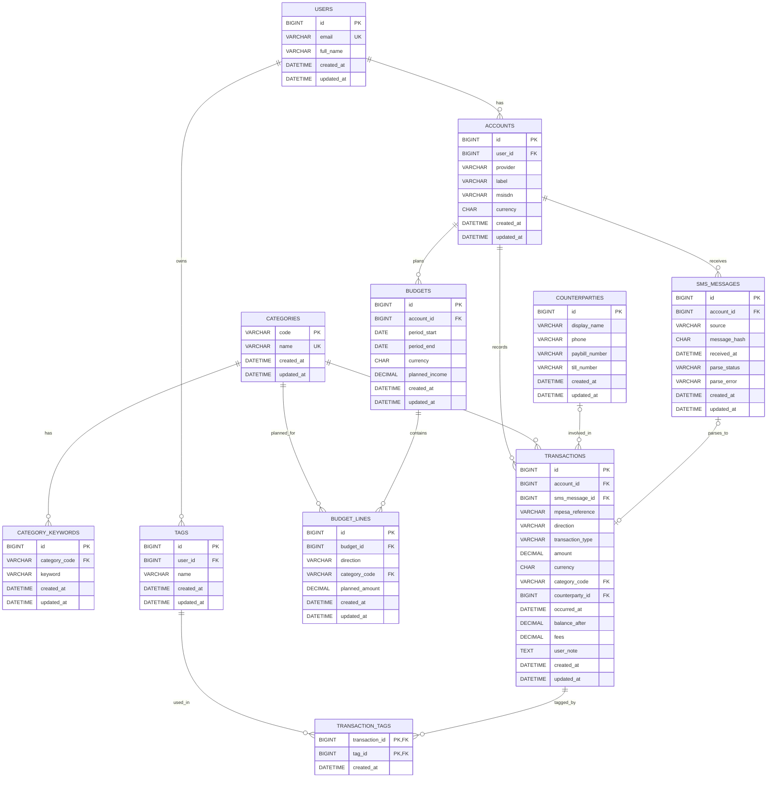

# ER Diagram (Normalized Schema)

This diagram matches the normalized schema files:

- `sql/schema_mysql.sql`
- `sql/schema_sqlite.sql`

## Notes

- `sms_messages` is optional (you can store only a hash for dedupe, or omit message storage entirely for privacy).
- `transactions.category_code` defaults to `uncategorized` and references `categories.code`.
- Budgets are modeled as a header (`budgets`) and line items (`budget_lines`) per category and direction.
